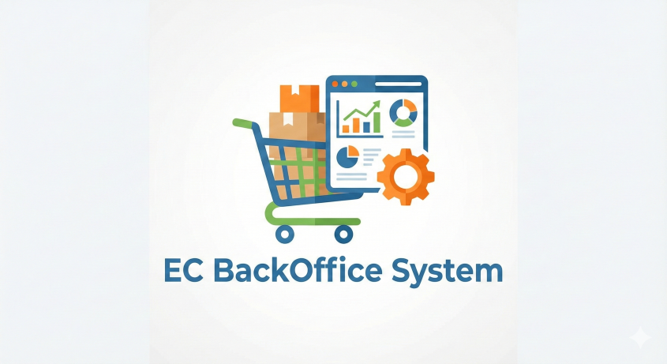

# Spring Mart

<div align="center">
  
  <br>
  <h1>Spring Mart</h1>
  <p>
    次世代ECサイト向けバックオフィスアプリケーション
  </p>
</div>

## 構成

- **バックエンド**: Spring Boot REST API
- **フロントエンド**: React (管理者向け管理画面 + 顧客向けECサイト)
- **データベース**: PostgreSQL

## 機能

### バックエンドAPI
- **認証機能**: JWTトークンベースの認証
- **商品管理**: 商品のCRUD操作
- **注文機能**: 注文作成と在庫引き当て処理

### フロントエンド
- **管理者向け管理画面**: 商品管理、注文管理
- **顧客向けECサイト**: 商品閲覧、カート機能、注文機能

## 起動方法

### 1. Docker Composeで起動

```bash
docker compose up -d --build
```

### 2. 起動確認

#### フロントエンド（React）
アプリケーションが起動したら、ブラウザで以下にアクセス：
- **フロントエンド**: `http://localhost:3000`
  - ログイン画面が表示されます
  - 管理者アカウント（admin/password123）でログイン → 管理画面
  - 一般ユーザーアカウント（user1/password123）でログイン → ECサイト

#### バックエンドAPI（直接アクセス）
- **API**: `http://localhost:8080`
  - テスト用Webインターフェース: `http://localhost:8080/`
  - ヘルスチェック: `http://localhost:8080/health`

#### コマンドラインで確認
##### Linux/Mac/WSL環境
```bash
./check_health.sh
```

##### Windows環境
```cmd
check_health.bat
```

## APIエンドポイント

### 認証API

- **POST /auth/login**: ログイン（JWTトークン取得）
  ```json
  {
    "userName": "admin",
    "password": "password123"
  }
  ```

### 商品管理API（要認証）

- **GET /api/products**: 商品一覧取得
- **GET /api/products/{id}**: 商品詳細取得
- **POST /api/products**: 商品登録
- **PUT /api/products/{id}**: 商品更新
- **DELETE /api/products/{id}**: 商品削除

### 注文API（要認証）

- **POST /api/orders**: 注文作成
  ```json
  {
    "items": [
      {
        "productId": 1,
        "quantity": 2
      }
    ]
  }
  ```

## 初期データ

- **管理者ユーザー**: `admin` / `password123`
- **一般ユーザー**: `user1` / `password123`
- **初期商品**: 3件（Spring Boot入門、Docker実践ガイド、React開発集中講座）

## 技術スタック

- Java 17
- Spring Boot 3.2.0
- Maven
- PostgreSQL
- Docker Compose
- JWT (認証)

## 開発環境

- Docker Desktop または Docker Engine
- Maven（コンテナ内に含まれています）

## 注意事項

- `/dev/**` エンドポイントは開発用です。本番環境では削除または無効化してください。
- ヘルスチェックエンドポイント: `GET /health` または `GET /` でアプリケーションの状態を確認できます。

## 詳細な使い方

- **APIの使い方**: [USAGE.md](USAGE.md) を参照
- **フロントエンドの使い方**: [FRONTEND_README.md](FRONTEND_README.md) を参照

## 画面構成

### 管理者向け管理画面
- `/admin/products` - 商品管理（一覧、登録、編集、削除）
- `/admin/orders` - 注文管理（今後実装予定）

### 顧客向けECサイト
- `/customer` - 商品一覧（カートに追加）
- `/customer/cart` - カート（数量変更、注文確定）

