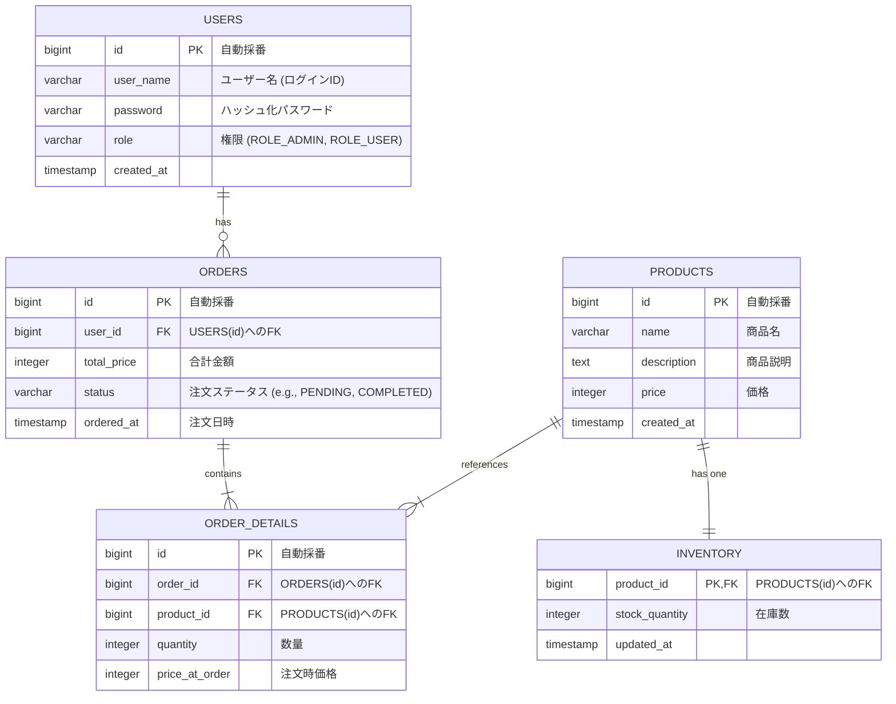

# **ER図 (Entity-Relationship Diagram)**

### **テーブル定義（抜粋）**

* **USERS (ユーザーテーブル):**  
  * role カラムで管理者(ADMIN)と一般ユーザー(USER)を区別する。  
* **PRODUCTS (商品マスタ):**  
  * 商品の基本情報。  
* **INVENTORY (在庫テーブル):**  
  * 商品の在庫数を管理。product\_id で商品マスタと1:1で紐づく。  
* **ORDERS (注文ヘッダー):**  
  * 1回の注文情報を管理。  
* **ORDER\_DETAILS (注文明細):**  
  * 1回の注文に含まれる商品ごとの明細。price\_at\_order で注文時点の価格を保持する（商品マスタの価格が変更されても影響を受けないため）。