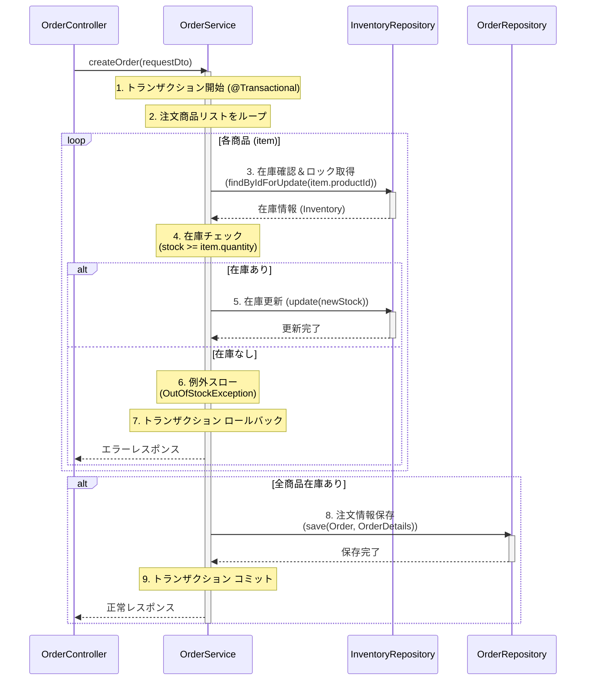

# **詳細設計書 (主要機能抜粋)**

## **1\. 注文機能 (F-201, F-202, F-203)**

### **1.1. クラス設計（役割）**

* **OrderController:**  
  * POST /api/orders のリクエストを受け取る。  
  * リクエストボディ (OrderRequest DTO) のバリデーション。  
  * OrderService を呼び出す。  
  * 結果をレスポンス (OrderResponse DTO) として返す。  
* **OrderService:**  
  * **@Transactional** を付与し、一連の処理をトランザクション管理する。  
  * createOrder メソッドがビジネスロジックの本体。  
  * InventoryRepository を使って在庫を確認・更新する。  
  * OrderRepository, OrderDetailRepository を使って注文情報をDBに保存する。  
* **InventoryRepository:**  
  * 在庫テーブル (INVENTORY) を操作する。  
  * **排他制御:** 在庫更新時には SELECT ... FOR UPDATE を使用し、行ロックを取得することで、同時更新による在庫の不整合を防ぐ。  
* **OrderRepository / OrderDetailRepository:**  
  * 注文ヘッダー・明細テーブルを操作する。

### **1.2. 注文処理シーケンス**

### **1.3. トランザクション・排他制御のポイント**

* **トランザクション:** OrderServiceのcreateOrderメソッドに@Transactionalアノテーションを付与する。これにより、処理中にRuntimeException（カスタム例外OutOfStockExceptionなど）が発生した場合、DB操作（在庫更新、注文登録）がすべてロールバックされる。  
* **排他制御:** InventoryRepositoryでの在庫読み取り時に、データベースの**悲観的ロック** (SELECT ... FOR UPDATE) を使用する。これにより、同じ商品に対する同時注文処理が発生した場合、先行するトランザクションが完了（コミット or ロールバック）するまで、後続の処理は在庫読み取りで待機させられる。